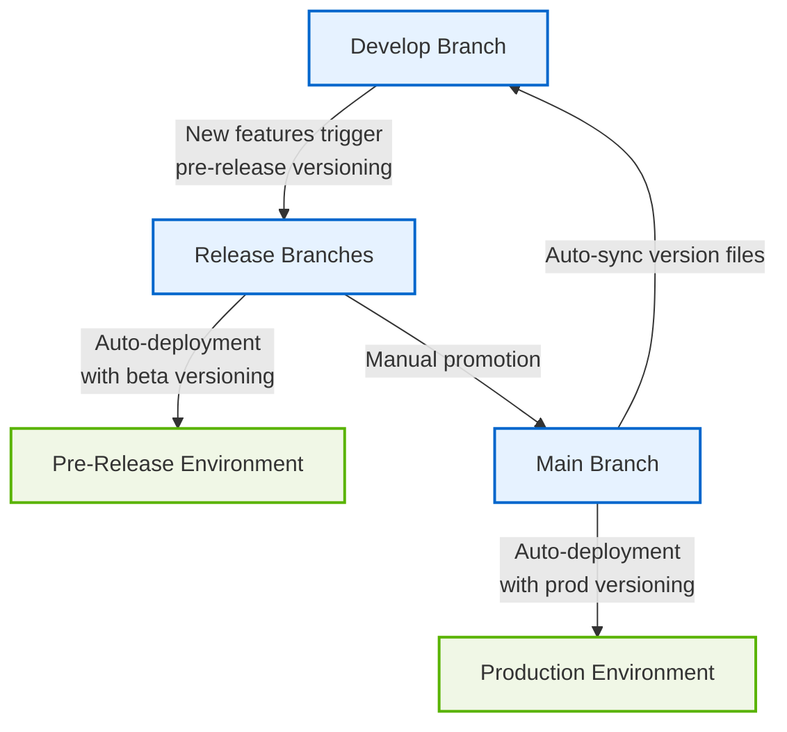

## Overview

This project implements a comprehensive CI/CD pipeline that manages releases through a GitFlow-inspired branching strategy with automated versioning, deployment, and cleanup processes.

## Workflow Diagram

## Key Workflows

### 1. Pre-Release Versioning (pre-release-versioning.yml)

**Purpose:** Automatically create release branches from develop when new features are ready for testing.

**Process:**
- Triggered on push to `develop`
- Calculates the next semantic version with beta tag
- Creates a new `release/vX.Y.Z` branch
- Serves as the foundation for pre-release deployment

### 2. Deployment Automation (deploy.yml)

**Purpose:** Handles deployments to both production and pre-release environments.

**Process:**
- Triggered on push to `main` or `release/*` branches
- Prevents recursive trigger loops with [skip ci] detection
- For `main` branch:
  - Builds and deploys to production environment
  - Creates final version tags and GitHub releases
  - Sets up production domain
  - Syncs version files back to develop
- For `release/*` branches:
  - Builds and deploys to pre-release environment
  - Creates beta version tags and draft GitHub releases
  - Sets up pre-release domain with pattern `release-X-Y-Z.projectname.rubrion.com`

### 3. Deployment Cleanup (deploy-cleanup.yml)

**Purpose:** Removes all resources when a release branch is deleted.

**Process:**
- Triggered on deletion of a `release/*` branch
- Removes Cloudflare deployments
- Removes custom domains and DNS records
- Deletes corresponding beta version tags on GitHub

### 4. Pre-Release Promotion (pre-release-promote.yml)

**Purpose:** Manually promote a release branch to production.

**Process:**
- Triggered manually with release branch parameter
- Merges specified release branch into main
- Optionally deletes the release branch after promotion

## Release Management

### Versioning Strategy

- **Production releases:** Semantic versioning (X.Y.Z)
- **Pre-releases:** Semantic versioning with beta suffix (X.Y.Z-beta.N)
- **Version Bumping Rules:**
  - **Major (X):** Breaking changes
  - **Minor (Y):** New features (non-breaking)
  - **Patch (Z):** Bug fixes
  - **No Version Change:** Documentation, style changes, tests, chores, and CI updates

### CHANGELOG Generation

- Automatically generates a CHANGELOG.md file using conventional commits
- Uses auto-changelog with a customized keepachangelog template
- Ensures clean, readable release history

## Configuration Files

- **.release-it.json:** Controls version bumping and release creation
- **.auto-changelog:** Formats the CHANGELOG output
- **package.json:** Contains dependencies and project metadata

## Security & Authentication

- Uses GitHub App tokens for secure authentication
- Implements proper permission handling for cross-branch operations
- Ensures CI/CD processes have necessary but limited access

## Environments

- **Production:** Main domain at `projectname.rubrion.com`
- **Pre-release:** Versioned domains at `release-X-Y-Z.projectname.rubrion.com`
- All deployments leverage Cloudflare Pages for hosting
